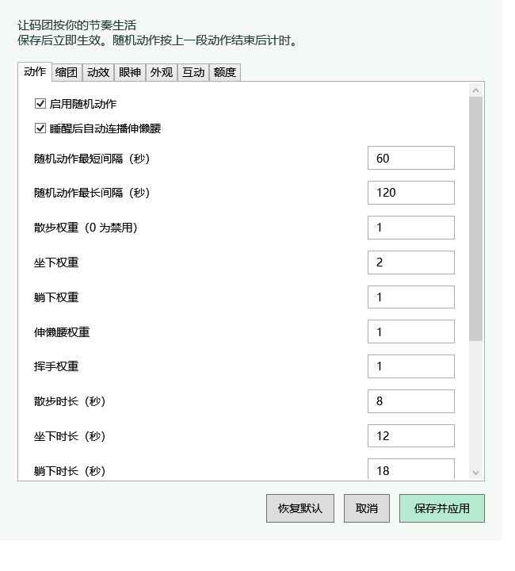

# 码团 · Codex Pet

薄荷色的小代码精灵，分别显示 Codex **5 小时与一周剩余用量**。灵感来自 [MeteorNOX 的 DeepSeek Balance Whale Widget](https://github.com/MeteorNOX/DeepSeek-Balance-Whale-Widget)。外观和实现为全新绘制，没有复制原项目素材或代码。


## v1.3.1：系统托盘入口

运行时右下角系统托盘显示码团图标。右键图标可显示码团、打开设置或退出；双击图标可展开并找回码团。Windows 可能将图标放在托盘的折叠菜单里，可拖到常用区域。退出时托盘图标一并清理。新版运行目录为 `%LOCALAPPDATA%\CodexUsagePet\1.3.1`，首次启动迁移 v1.3.0 的设置。

## v1.3：安静缩团、可调节奏与柔和过渡

默认每段动作结束后安静 60–120 秒，随机散步、坐下、侧躺打盹、伸懒腰或挥手，按可设置权重抽取动作，多个动作可选时避免连续重复；只有一种动作启用时允许重复。散步约 8 秒、坐下 12 秒、打盹 18 秒、伸懒腰 5 秒。散步会让宠物和用量卡在主屏工作区内实际移动 90–170 像素，脚步跟随行进距离；点击、拖动或打开菜单可停止。修复 v1.1 位移进度被取整导致的原地踏步和跳跃。专注计时期间不会随机散步。

坐姿使用独立的朝前脚掌与垂下的双手，先伸脚再落座，保持脸部比例。待机时有呼吸、轻微晃头、随机视线、偶尔连续眨眼；鼠标移到宠物上时目光跟随。睡醒后可自动连播伸懒腰（默认开启，可在设置中关闭），点击有笑脸和弹性反馈。

### 空闲缩团与设置

默认空闲 15 秒后，码团用 1.2 秒渐渐缩到正常大小的 42%，收起手脚与额度卡。鼠标移入、有效额度变化或开始动作时展开；至少保持 8 秒，再按空闲时长决定是否收起。仅刷新时间戳不会唤醒它。缩团期间隐藏的额度卡不响应鼠标。

右键 → **设置…** 可修改动作最短/最长间隔、各动作权重和时长、散步距离与方向概率、步幅、自动连播、缩团时长/大小、过渡速度、呼吸和眨眼周期/概率、视线、帧率、字体与文字大小、透明度、置顶、气泡时长、专注时长、吸边距离、额度刷新/过期时间与心情阈值。美术路径和轮廓坐标仍由代码定义。最小值不能大于最大值，过期时间至少比刷新间隔多 30 秒；恢复默认需保存才生效，取消不会应用修改。

动作切换从当前实际姿势融合到目标姿势，默认 0.9 秒；动作自身采用柔和起止缓动。随机动作及睡醒连播全部完成后，才开始下一次等待。




### 额度小表情

取五小时与一周剩余额度的较小值：≥50% 开心；20%–50% 之间平静；0%–20%（含 20%）担心；0% 委屈流泪。恢复额度后自动更新，悬停宠物可查看原因。数据超过 120 秒未同步、任一档缺失或已到重置时间时使用中性表情，缓存不会伪装成实时心情。以上为默认设置，阈值与过期时长可以调整。这些阈值是宠物的表现规则，不是 OpenAI 官方额度等级。

| 额度充足 | 快用完了 | 用完了 |
| --- | --- | --- |
|  |  |  |

右键可以点播动作，也可以关闭随机待机。安静模式会暂停自动动作；手动点播动作会恢复灵动模式。

默认使用微软雅黑 UI，可在设置中切换字体；用量数字为 15 号半粗体。文字与宠物分开布局，小号宠物也保留清晰的文字大小；增加像素对齐与文字背景对比度。

| 坐下陪伴 | 侧躺休息 |
| --- | --- |
|  |  |

Windows 10/11 桌面小宠物。推荐到 [Releases](https://github.com/Rxwkovo/Codex-Usage-Pet/releases/latest) 下载 EXE 后双击运行，无命令行窗口。同一用户重复启动 EXE 不会重复创建宠物。EXE 将内置程序解压到 `%LOCALAPPDATA%\CodexUsagePet\1.3.0`，设置与用量缓存也保存在此处。退出后删除该目录与 EXE 即可移除。

也可以下载源码 ZIP 并解压，双击「启动码团.vbs」启动。界面使用 Windows 自带的 PowerShell 5.1、.NET Framework 和 WPF。用量功能需要已安装 Codex 桌面版或 PATH 中的 codex.exe，并使用 ChatGPT 账户登录。EXE 内含宠物程序，不包含 Codex 本身。

- 单击：摸摸、弹性回弹、随机台词。
- 拖动：调整位置，靠近主屏工作区四边时吸附。
- 右键 → 设置：动作、缩团、动效、眼神、外观、互动、额度七类设置；专注时长也可调整。
- 位置保存在 settings.json；行为与外观参数保存在 preferences.json，保存后立即生效，重启后保留。
- 安静模式关闭悬浮和眨眼动画。
- 30 帧节奏的悬浮呼吸、叶芽摇摆、自然闭眼动画；触碰弹性回弹、气泡淡入和用量条平滑过渡。
- 随机待机动作：散步、坐下、躺下、伸懒腰；支持右键点播和开关，偏好随设置保存。
- 五小时和一周分别显示剩余百分比、进度条，悬停文字查看本地时间的重置时刻。
- 每 60 秒后台读取一次；右键可手动刷新。按接口返回的 300 / 10080 分钟分类，不假设 primary 一定是五小时。
- 缺少某一档时显示「暂无数据」，不会把缺失数据当作 0%。网络异常保留缓存并标明时间；到达重置时刻后等待同步，不自行假设额度已恢复。

这是独立桌面伴侣，不是嵌入 Codex 内部的插件。通过 [官方 App Server](https://developers.openai.com/codex/app-server) 的 `account/rateLimits/read` 读取当前 CLI 登录账户的额度，不读取会话、不直接读取密钥、不调用模型、不消耗额度重置券。CLI 与桌面若登录不同账户，以 CLI 的数据为准。界面显示的是订阅额度剩余比例，不是 API 余额。

查询在独立隐藏进程运行，不阻塞拖拽。先尝试不使用 HTTP/HTTPS/ALL_PROXY 的直连（12 秒超时），失败后使用原环境的网络配置重试（25 秒超时）。界面标明「直连」「系统网络」或「缓存」。这不会切换系统 VPN；如果网络使用 VPN 隧道，直连请求仍可能经过隧道。关闭 VPN 后能否在线取到数据取决于本地网络能否访问官方服务，软件不能保证绕过网络阻断。

仅将两档百分比、重置时间、网络路线和同步状态写入本地 usage.json，不保存完整账户响应。该缓存与个人设置均被 .gitignore 排除。

专注结束只在宠物上提醒，不播放声音。退出后专注计时不保留。未设置开机自启。吸附限主屏工作区；暂不提供跨屏吸附或 Codex 工作状态联动。

如系统不支持 VBS，在此文件夹的 PowerShell 中运行：

```powershell
powershell.exe -NoProfile -ExecutionPolicy Bypass -STA -File .\pet.ps1
```

删除整个文件夹即可卸载；先右键退出宠物。

## 开发验证

```powershell
powershell.exe -NoProfile -ExecutionPolicy Bypass -File .\tests\usage.tests.ps1
powershell.exe -NoProfile -ExecutionPolicy Bypass -File .\tests\behavior.tests.ps1
powershell.exe -NoProfile -ExecutionPolicy Bypass -File .\tests\mood.tests.ps1
powershell.exe -NoProfile -ExecutionPolicy Bypass -File .\tests\preferences.tests.ps1
powershell.exe -NoProfile -ExecutionPolicy Bypass -STA -File .\pet.ps1 -Preview
powershell.exe -NoProfile -ExecutionPolicy Bypass -STA -File .\pet.ps1 -Preview -PreviewAction sleep
powershell.exe -NoProfile -ExecutionPolicy Bypass -STA -File .\pet.ps1 -Smoke
```

预览参数使用明确标注的示例数据，不发起用量查询。请保持 pet.ps1 为 UTF-8 BOM 编码，以兼容 Windows PowerShell 的中文文本。

MIT License。欢迎改造自己的小宠物。

### 构建 EXE

```powershell
powershell.exe -NoProfile -ExecutionPolicy Bypass -File .\build.ps1
```

使用 Windows .NET Framework 自带的 C# 编译器。输出到 `dist/`，同时生成 SHA-256 校验文件。构建仅打包明确列出的程序、说明和许可证，不包含个人设置、用量缓存、密钥或开发日志。`launcher.cs` 为完整启动器源码；`--smoke` 可运行短时窗口与实际位移检查后自动退出。
